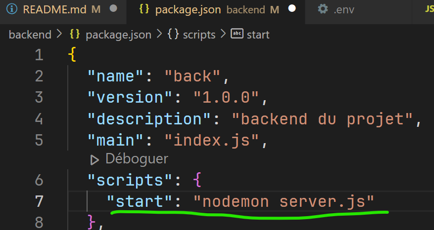
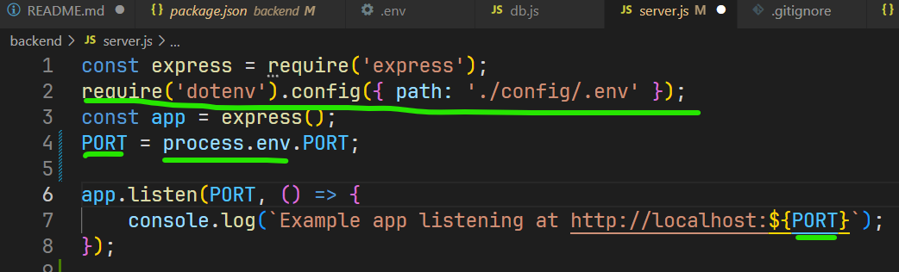
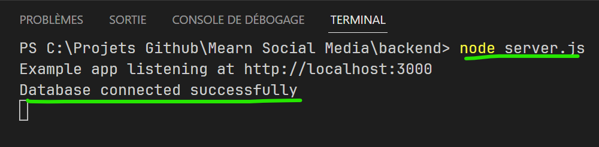
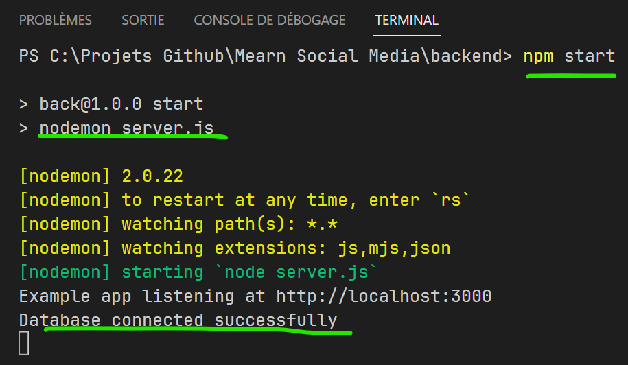

# Projet MERN

- Définition : MERN est un acronyme représentant un ensemble de technologies (à la fois côté serveur et côté client) permettant de développer des applications web full stack. Voici les 4 technologies utilisées par cette stack :

  - MongoDB
  - Express.js
  - React
  - Node

## Le backend :

- Dans le terminal ouvrir votre dossier backend et lancer la commande `npm init' pour initialiser le projet.
- Installer nodemon `npm install nodemon'
  - nodemon est un outil qui permet de relancer automatiquement le serveur à chaque modification du code.

- il suffira de lancer la commande `npm start' pour lancer le serveur.
- Installer express `npm install express '
  - "Express" est un framework pour Node.js qui facilite la création d'applications web en fournissant des fonctionnalités pour la gestion des requêtes HTTP, la définition des routes, la gestion des sessions, la gestion des cookies, etc.
- Installer dotenv `npm install dotenv'
  - Dotenv est un module qui permet de charger des variables d'environnement depuis un fichier .env.
- Creer un dossier config et un fichier .env pour les informations sensibles.

- Creer un fichier server.js (ou index.js) qui sera la base de notre serveur.
- Installer mongoose `npm install mongoose'
  - Mongoose est un module qui permet de faciliter la gestion de la base de données MongoDB.
- Confifuger dans le dossier config le fichier db.js pour la connexion à la base de données.

- Tester la connexion à la base de données dans le fichier server.js

- ou avec nodemon :

